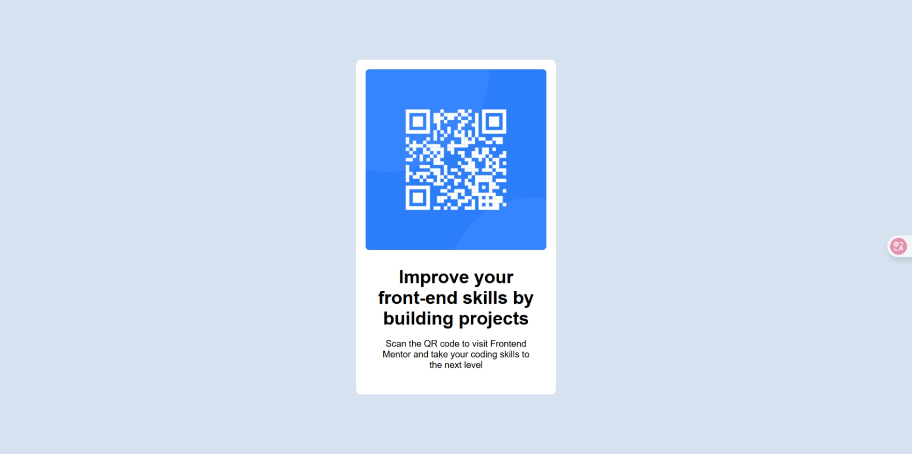

# Frontend Mentor - QR code component solution

This is a solution to the [QR code component challenge on Frontend Mentor](https://www.frontendmentor.io/challenges/qr-code-component-iux_sIO_H).  
Frontend Mentor challenges help you improve your coding skills by building realistic projects.

## Table of contents

- [Overview](#overview)
  - [Screenshot](#screenshot)
  - [Links](#links)
- [My process](#my-process)
  - [Built with](#built-with)
  - [What I learned](#what-i-learned)
  - [Continued development](#continued-development)
  - [Useful resources](#useful-resources)
- [Author](#author)

---

## Overview

This project is a simple **QR code component** built using **HTML and CSS**.  
The goal was to recreate a clean and responsive card layout that matches the design provided by [Frontend Mentor](https://www.frontendmentor.io).

It displays a QR code that, when scanned, leads users to the Frontend Mentor website.  
The challenge focuses on practicing layout skills (centering, spacing, font styling) and learning how to make content responsive for both **mobile (375px)** and **desktop (1440px)** screens.

### Screenshot



### Links

- Solution URL: [https://github.com/CD1CH/qr-code-component](https://github.com/CD1CH/qr-code-component)
- Live Site URL: [https://cd1ch.github.io/qr-code-component/](https://cd1ch.github.io/qr-code-component/)

---

## My process

### Built with

- Semantic HTML5 markup
- CSS custom properties
- Flexbox
- Mobile-first workflow

### What I learned

Through this challenge, I practiced:

- How to center a div both horizontally and vertically using **Flexbox**:

```css
body {
  display: flex;
  align-items: center;
  justify-content: center;
  min-height: 100vh;
}
```
